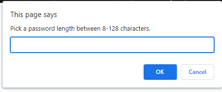
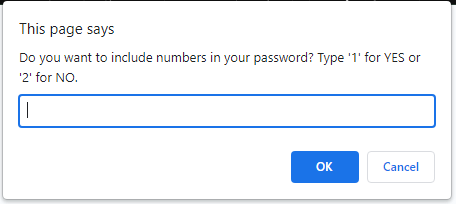
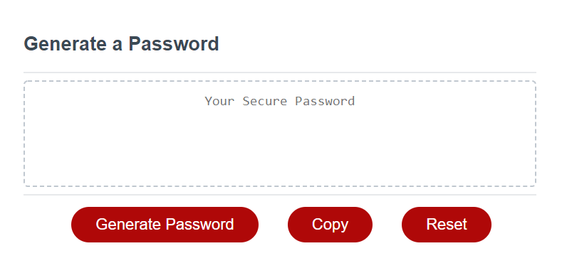
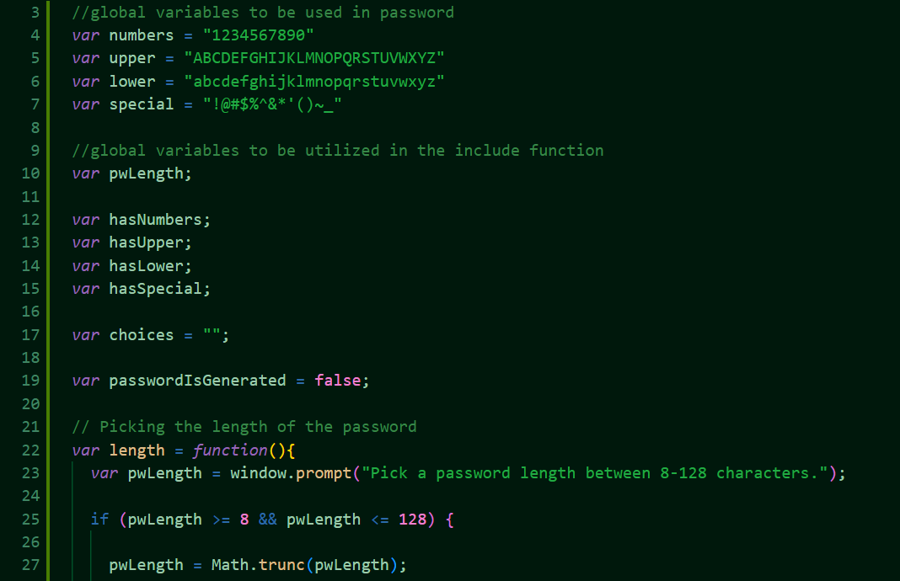
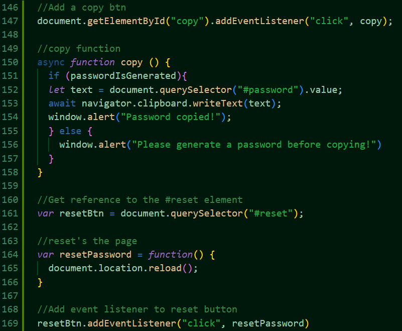

# Password Generator

The password generator was created to help users generate new passwords.

## Description

The password generator aides users in creating new passwords. The website asks users if they want four different conditions to be used in the creating of their password. Based on a user's input, a dynamically generated password will appear when the user clicks the 'Generate Password'.

## Technologies Used

- HTML
- CSS
- JavaScript

## Usage and Website

[The Password Generator](https://kirstgonz.github.io/generate-password/) helps users create random passwords. It can be accessed by clicking 'The Password Generator' or clicking on the link below. No installation is necessary.

- https://kirstgonz.github.io/generate-password/

Users are asked to pick the amount of characters in their password between 8-128.

Then, users are asked if they would like to include numbers, uppercase letters, lowercase letters, and special characters. The user inputs either a '1' for yes or a '2' for no.

Once the user has made their choices, they can click 'Generate Password.' If the user is not satisfied with their password, they can continue to click 'Generate Password' for a new one. If the user would like to copy the password, they can click the 'Copy' button. If the user would like to generate a new password with different parameters, they can click the 'Reset' button.

Below is an example of the JavaScript global variables used.

Below shows  how the buttons were made. Initially, only a 'Generate Password' button was available. The 'Copy' and 'Reset' button and their usage were implemented by me.

## Credits

Starter code made by [Xander Rapstine](https://github.com/Xandromus) 

Built on by [Kirstyn Gonzalez](https://github.com/kirstgonz)

Copy button utliized by code found [here](https://dev.to/walternascimentobarroso/creating-copy-button-with-js-4763)

## License

[https://choosealicense.com/](https://choosealicense.com/).

